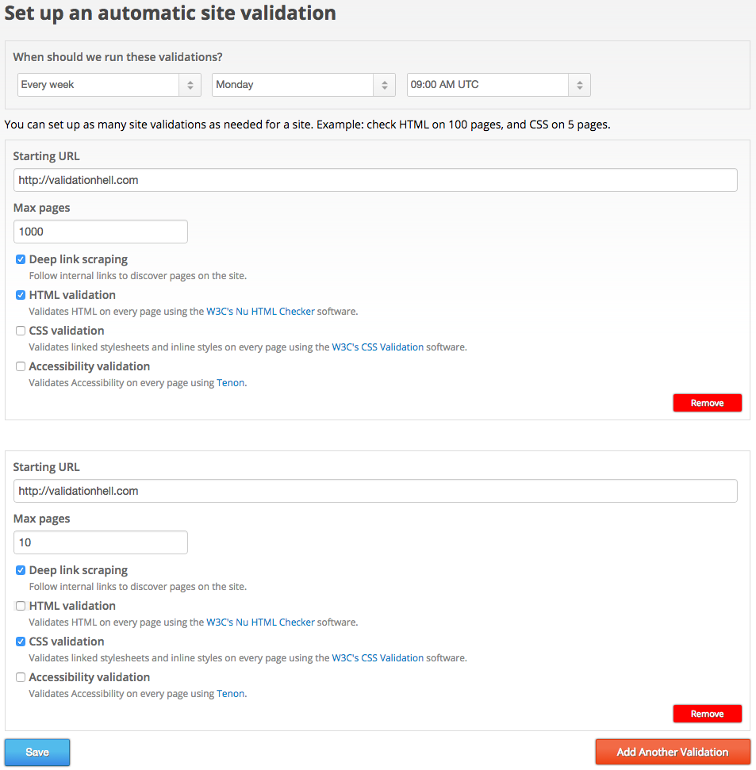
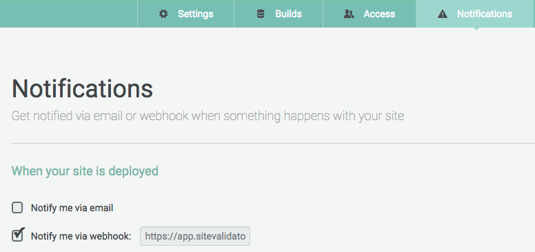

# Continuous Validation

Continous Validation lets you run automatic validations on your sites when a new version is deployed.

<iframe src="//fast.wistia.net/embed/iframe/w2xu1aedtf?videoFoam=true" allowtransparency="true" frameborder="0" scrolling="no" class="wistia_embed" name="wistia_embed" allowfullscreen mozallowfullscreen webkitallowfullscreen oallowfullscreen msallowfullscreen width="720" height="478"></iframe><script src="//fast.wistia.net/assets/external/E-v1.js"></script>

## Setting up a Deploy Validator

To set up automatic validations for your sites, you should first define what validations should be run. We can define one or several validations to be started, in this example we're specifying that a site should validate HTML on up to 100 pages and CSS on up to 5 pages:



## Setting up a Deploy Notification

Once you've defined your deploy validator, you can tell your hosting platform to notify us when a new version of your site is deployed. Basically, it's as simple as letting them know the URL of the deploy validator you just defined.

On the following examples, we'll suppose the deploy validator you defined has this URL:

```bash
https://app.sitevalidator.com/u/abcde/d/12345
```

## Example: curl

[curl](http://curl.haxx.se/) is a command-line tool, present in most systems, that you can use to make a quick check from your terminal:

```bash
$ curl -X POST -d '' https://app.sitevalidator.com/u/abcde/d/12345
```

## Example: Netlify

[Netlify](https://www.netlify.com/) is a hosting platform for static websites, and offers the simplest integration possible. You just need to paste your deploy validator URL into the Notifications section of your site, like this:



## Example: Heroku

If your site is on Heroku, you can use the [free HTTP post hook add-on](https://devcenter.heroku.com/articles/deploy-hooks#http-post-hook), like this:

```bash
$ heroku addons:add deployhooks:http \
  --url https://app.sitevalidator.com/u/abcde/d/12345
```

## Example: Cloud 66

If your site is on Cloud 66, you can use their [free deploy hooks](http://help.cloud66.com/deployment/deploy-hooks) to define your hooks per environment on a file named .cloud66/deploy_hooks.yml, like this:

```yml
staging:
  last_thing:
    - command: curl -X POST -d '' https://app.sitevalidator.com/u/abcde/d/12345
      target: rails
      run_on: single_server
```

## Other platforms

If your hosting platform is not listed here, feel free to [contact us](support@sitevalidator.com) and we'll help you with the integration.

## Pausing a validator

You can pause a deploy validator, so that it will not fire any validations until you re-activate it.

## Response status codes

When a deploy notification is received, Site Validator will return one of these possible status codes:

* **201 Created**. All went well and the site validations were initiated.
* **404 Not Found**. The deploy validator was not found. You might have typed it incorrectly, or removed it. When a deploy validator is paused, a 404 will be returned.
* **400 Bad Request**. The deploy validator was found, but site validations could not be started. Normally, this means you have run out of validation credits.
