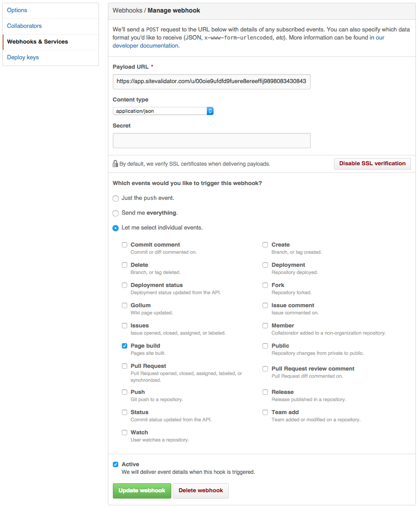

# Continuous Validation

You can set up automatic validations for your sites, to be run periodically or triggered when a deploy hook is received.

## Setting up an Automatic Validation

When you set up an automatic validation, you can specify an schedule for it. This is optional and can be set to be daily, weekly or monthly, specifying as well the exact day (of the week or month) and the hour.

Then, you can define one or several validations to be started. In this example we're specifying that a site should validate HTML on up to 100 pages and CSS on up to 5 pages, every tuesday at 09:00 AM.


## Setting up a Deploy Notification

Continous Validation lets you also run automatic validations on your sites when a new version is deployed.

<iframe src="//fast.wistia.net/embed/iframe/w2xu1aedtf?videoFoam=true" allowtransparency="true" scrolling="no" class="wistia_embed" name="wistia_embed" allowfullscreen mozallowfullscreen webkitallowfullscreen oallowfullscreen msallowfullscreen width="720" height="478"></iframe><script src="//fast.wistia.net/assets/external/E-v1.js"></script>

Once you've defined your automatic validator, you can tell your hosting platform to notify us when a new version of your site is deployed. Basically, it's as simple as letting them know the URL of the automatic validator you just defined.

On the following examples, we'll suppose the automatic validator you defined has this URL:

```
https://app.sitevalidator.com/u/abc/d/efg
```

## Example: curl

[curl](http://curl.haxx.se/) is a command-line tool, present in most systems, that you can use to make a quick check from your terminal:

```bash
$ curl -X POST -d '' https://app.sitevalidator.com/u/abc/d/efg
```

## Example: Netlify

[Netlify](https://www.netlify.com/) is a hosting platform for static websites, and offers the simplest integration possible. You just need to paste your automatic validator URL into the Notifications section of your site, like this:


Currently, Netlify only allows one HTTP deploy hook per app, so if you need to trigger several hooks, you can set it up using [deploy hook forker](https://github.com/deadlyicon/deploy-hook-forker).

## Example: Heroku

If your site is on Heroku, you can use the [free HTTP post hook add-on](https://devcenter.heroku.com/articles/deploy-hooks#http-post-hook), like this:

```bash
$ heroku addons:create deployhooks:http \
  --url https://app.sitevalidator.com/u/abc/d/efg
```

Heroku only allows one HTTP deploy hook per app, so if you need to trigger several hooks, you can set it up using [deploy hook forker](https://github.com/deadlyicon/deploy-hook-forker).

## Example: Engine Yard

Engine Yard lets you define [deploy hooks using simple ruby scripts](https://support.cloud.engineyard.com/entries/21016568-use-ruby-deploy-hooks). To trigger a site validation, you can create a **deploy/after_restart.rb** file on the root folder of your app, that sends the post-deploy hook using curl like this:

```ruby
run "curl -X POST -d '' https://app.sitevalidator.com/u/abc/d/efg"
```

Engine Yard lets you use several deploy hooks for your apps, just include them on the same file.

## Example: Cloud 66

If your site is on Cloud 66, you can use their [free deploy hooks](http://help.cloud66.com/deployment/deploy-hooks) to define your hooks per environment on a file named **.cloud66/deploy_hooks.yml**, like this:

```yml
staging:
  last_thing:
    - command: curl -X POST -d '' https://app.sitevalidator.com/u/abc/d/efg
      target: rails
      run_on: single_server
```

Cloud 66 let you have several deploy hooks defined. The syntax for doing that is:

```yml
environment:
  last_thing:
    - xxxxxx
      yyyyyy
      zzzzzz
    - xxxxxx
      yyyyyy
      zzzzzz
```

## Example: Github Pages

[Github Pages](https://pages.github.com/) let you define webhooks for different events. You just need to enter your automatic validator URL in the Payload URL field, and choose the individual event for **page build**:



Github Pages lets you define several deploy hooks for different services.

## Other platforms

If your hosting platform is not listed here, feel free to [contact us](mailto:support@sitevalidator.com) and we'll help you with the integration.

## Pausing a validator

You can pause a automatic validator, so that it will not fire any validations until you re-activate it.

## Response status codes

When a deploy notification is received, Site Validator will return one of these possible status codes:

* **201 Created**. All went well and the site validations were initiated.
* **404 Not Found**. The automatic validator was not found. You might have typed it incorrectly, or removed it. When a automatic validator is paused, a 404 will be returned.
* **400 Bad Request**. The automatic validator was found, but site validations could not be started. Normally, this means you have run out of validation credits.
