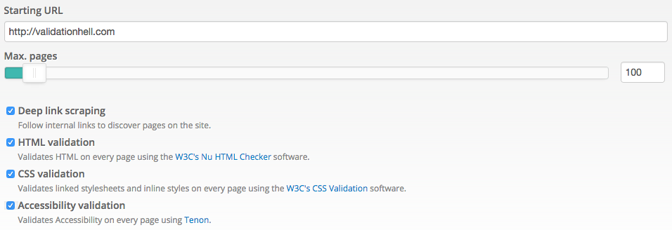

# Site-Wide Validation

To validate HTML, CSS and/or Accessibility on a site, all you need to do is specify the starting URL. Here are the additional options that you can set.



## Options

To validate a site, you can define:

* **Starting URL**. Our validation spider will visit this URL and its direct internal links, and validate those pages. Typically, you can enter the main URL of the site to validate, but it can be any URL from your site, or an XML sitemap.
* **Max. pages**. The maximum number of pages to validate. There's a limit of 2,000 pages per each site validation, but you'll typically want to set a much lower limit.
* **Deep link scraping**. By default, the validation spider will follow all internal links found, discovering more pages, until the max pages limit is reached or no more pages are found. This provides an easy way to submit a large site, but it's also slower than specifying exactly the URLs to validate with an XML sitemap.
* **HTML validation**. If enabled, each page will be validated for HTML conformance.
* **CSS validation**. If enabled, each page will be validated for CSS conformance. This will validate both inline styles and the linked stylesheets for each page.
* **Accessibility validation**. If enabled, each page will be validated for Accessibility issues.

## HTML Validation

We use the [W3C Nu HTML Checker](http://validator.w3.org/nu/), hosted on our own servers, for HTML conformance checking.

## CSS Validation

We use the [W3C CSS Validation Service](https://jigsaw.w3.org/css-validator/), hosted on our own servers, for CSS conformance checking.

## Accessibility Validation

We use Google Chrome's [Accessibility Developer Tools](https://github.com/GoogleChrome/accessibility-developer-tools/wiki/Audit-Rules), hosted on our own servers, for Accessibility checking.

For full descriptions of the audit rules, visit the [Accessibility Developer Tools project wiki](https://github.com/GoogleChrome/accessibility-developer-tools/wiki/Audit-Rules).

Code                       | Title
---------------------------|----------------------------------------------------
[AX_ARIA_01][AX_ARIA_01]   | Elements with ARIA roles must use a valid, non-abstract ARIA role.
[AX_ARIA_02][AX_ARIA_02]   | ARIA attributes which refer to other elements by ID should refer to elements which exist in the DOM.
[AX_ARIA_03][AX_ARIA_03]   | Elements with ARIA roles must have all required attributes for that role.
[AX_ARIA_04][AX_ARIA_04]   | ARIA state and property values must be valid.
[AX_ARIA_05][AX_ARIA_05]   | role=main should only appear on significant elements.
[AX_ARIA_06][AX_ARIA_06]   | aria-owns should not be used if ownership is implicit in the DOM.
[AX_ARIA_07][AX_ARIA_07]   | An element's ID must not be present in more that one aria-owns attribute at any time.
[AX_AUDIO_01][AX_AUDIO_01] | Audio elements should have controls.
[AX_COLOR_01][AX_COLOR_01] | Text elements should have a reasonable contrast ratio.
[AX_FOCUS_03][AX_FOCUS_03] | Avoid positive integer values for tabIndex.
[AX_HTML_01][AX_HTML_01]   | The web page should have the content's human language indicated in the markup.
[AX_IMAGE_01][AX_IMAGE_01] | Meaningful images should not be used in element backgrounds.
[AX_TEXT_01][AX_TEXT_01]   | Controls and media elements should have labels.
[AX_TEXT_02][AX_TEXT_02]   | Images should have an alt attribute.
[AX_TEXT_04][AX_TEXT_04]   | The purpose of each link should be clear from the link text.
[AX_TITLE_01][AX_TITLE_01] | The web page should have a title that describes topic or purpose.
[AX_VIDEO_01][AX_VIDEO_01] | Video elements should use <track> elements to provide captions.

[AX_ARIA_01]: https://github.com/GoogleChrome/accessibility-developer-tools/wiki/Audit-Rules#ax_aria_01
[AX_ARIA_02]: https://github.com/GoogleChrome/accessibility-developer-tools/wiki/Audit-Rules#ax_aria_02
[AX_ARIA_03]: https://github.com/GoogleChrome/accessibility-developer-tools/wiki/Audit-Rules#ax_aria_03
[AX_ARIA_04]: https://github.com/GoogleChrome/accessibility-developer-tools/wiki/Audit-Rules#ax_aria_04
[AX_ARIA_05]: https://github.com/GoogleChrome/accessibility-developer-tools/wiki/Audit-Rules#ax_aria_05
[AX_ARIA_06]: https://github.com/GoogleChrome/accessibility-developer-tools/wiki/Audit-Rules#ax_aria_06
[AX_ARIA_07]: https://github.com/GoogleChrome/accessibility-developer-tools/wiki/Audit-Rules#ax_aria_07
[AX_AUDIO_01]: https://github.com/GoogleChrome/accessibility-developer-tools/wiki/Audit-Rules#ax_audio_01
[AX_COLOR_01]: https://github.com/GoogleChrome/accessibility-developer-tools/wiki/Audit-Rules#ax_color_01
[AX_FOCUS_03]: https://github.com/GoogleChrome/accessibility-developer-tools/wiki/Audit-Rules#ax_focus_03
[AX_HTML_01]: https://github.com/GoogleChrome/accessibility-developer-tools/wiki/Audit-Rules#ax_html_01
[AX_IMAGE_01]: https://github.com/GoogleChrome/accessibility-developer-tools/wiki/Audit-Rules#ax_image_01
[AX_TEXT_01]: https://github.com/GoogleChrome/accessibility-developer-tools/wiki/Audit-Rules#ax_text_01
[AX_TEXT_02]: https://github.com/GoogleChrome/accessibility-developer-tools/wiki/Audit-Rules#ax_text_02
[AX_TEXT_04]: https://github.com/GoogleChrome/accessibility-developer-tools/wiki/Audit-Rules#ax_text_04
[AX_TITLE_01]: https://github.com/GoogleChrome/accessibility-developer-tools/wiki/Audit-Rules#ax_title_01
[AX_VIDEO_01]: https://github.com/GoogleChrome/accessibility-developer-tools/wiki/Audit-Rules#ax_video_01

## Performance tips

Validating a large site can take a considerable amount of time, so in order to get your results sooner, consider:

### Using an XML sitemap

You can provide an XML sitemap specifying the exact URLs to validate. If you do so, we won't need to crawl your site to discover the pages to validate, so we can start validating pages sooner.

You can [read about the XML sitemaps protocol here](http://www.sitemaps.org/protocol.html), but in short, all you need is to specify each URL in this format:

```xml
<?xml version="1.0" encoding="UTF-8"?>
<urlset xmlns="http://www.sitemaps.org/schemas/sitemap/0.9">
  <url>
    <loc>http://example.com/page1</loc>
  </url>
  <url>
    <loc>http://example.com/page2</loc>
  </url>
  <url>
    <loc>http://example.com/page3</loc>
  </url>
</urlset>
```

You can generate this XML sitemap manually or by using a tool [like this one](https://www.xml-sitemaps.com/).

Using XML sitemaps leads to much faster site validations, but also lets you be more organized when validating large sites. For example, you can use different XML sitemaps for the different sections in a large site.

### Disabling deep link scraping

By default, our validation spider will follow the initial URLs found from the starting URL, and discover additional pages until it reaches the indicated maximum pages to validate.

If you don't need us to discover additional pages, you can disable this option. For example, when you're submitting an XML sitemap with an exact set of pages to validate.

### Validating a smaller set of pages

While it's tempting to try to validate sites in its entirety, in most cases that's unnecessary. For example, the [New York Times](https://www.google.com/?q=site:nytimes.com) site has over 33 million URLs, it would be impossible to validate the whole site. When you have a blog, or an online store, your site has easily thousands of pages, but most of them are using the same layout. Instead of validating each of them, consider building an XML sitemap with a sample of each different kind of page. You'll save credits and time.

### Validate CSS separately

If you're validating CSS, most of the pages will be using the same stylesheets, so it's unnecessary to validate hundreds of pages for CSS. Consider validating just a small set of pages.

Also, you can check HTML, Accessibility and CSS separately. For example, if you have a 300-page site, you could validate HTML and Accessibility on 300 pages (or less), and CSS on 5 pages (or probably, just 1 page!).
